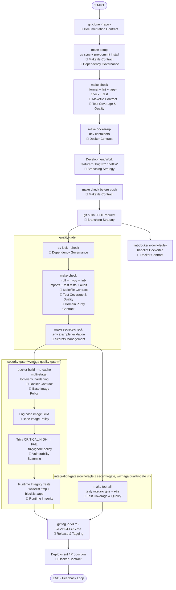

# Development & CI/CD Flow

Diagram przedstawia pełny przepływ od klonowania repo do produkcji. Każdy krok powiązany z konkretnym kontraktem.

---



---

## Kontrakty architektoniczne — egzekwowane przez `make check`

Kontrakty architektoniczne nie są osobnym krokiem w pipeline — są wbudowane w `make check` przez `mypy` i `lint-imports`:

```
make check
├── ruff format --check     → styl kodu
├── ruff lint               → reguły jakości + TID251 (zakaz bibliotek w domain/)
├── mypy                    → typy per-warstwa (strict dla domain/ i application/)
├── lint-imports            → kierunek zależności (Domain Purity, Import Direction)
├── pytest -m "not integration"  → testy jednostkowe + coverage
└── audit_contracts.py      → AST scan: forbidden imports, determinism, dataframe, env access
```

| Kontrakt | Narzędzie w make check |
|----------|----------------------|
| Domain Purity | ruff TID251 + import-linter + audit_contracts.py |
| Error Boundary | ruff B001 (bare except) + mypy |
| Determinism | audit_contracts.py + ruff banned-api |
| DataFrame | audit_contracts.py + mypy (typy) |
| Configuration | audit_contracts.py (os.getenv w application/) |
