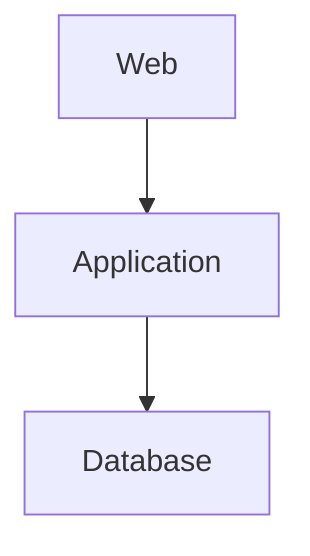
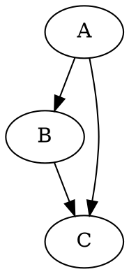

# Architecture Documentation & Visualization

## Cel

Przedstawienie architektury systemu w sposób zrozumiały dla człowieka i utrzymanie dokumentacji możliwie blisko kodu.

## Pytanie, na które odpowiada ta grupa

„Jak architekturę zrozumieć i zakomunikować?”

## Architecture Governance Model

                         ARCHITECTURE GOVERNANCE
                                  │
           ┌────────────────────┼────────────────────┐
           │                    │                    │
           ▼                    ▼                    ▼
       ENFORCEMENT          DISCOVERY             QUALITY
           │                    │                    │
           ▼                    ▼                    ▼
    Import Linter             pydeps               Radon
                              pyreverse              Xenon
                              Graphviz                wily
           │                    │                    │
           ▼                    ▼                    ▼
      architectural         actual structure      complexity
         rules                                      trends
           │                    │                    │
           └────────────────────┼────────────────────┘
                                ▼
                        Architecture Evidence
                                │
                                ▼
                  Architecture Documentation & Visualization
                                │
                                ▼
                         C4 / PlantUML / Structurizr
                                │
                                ▼
                   Designed Architecture Views

### Rozróżnienie: Designed vs Generated

| Typ | Odpowiada na pytanie | Narzędzia | Przykład |
|-----|---------------------|-----------|---------|
| **Designed Architecture** | Jak system powinien być zorganizowany? | C4, PlantUML, Structurizr | `docs/architecture/context.puml` |
| **Generated Architecture** | Jak kod faktycznie wygląda? | pydeps, pyreverse, Graphviz | `docs/architecture/dependencies-pydeps.svg` |

To rozróżnienie jest kluczowe:
- **Designed** = intencja architektoniczna
- **Generated** = rzeczywista implementacja

Porównywanie tych dwóch widoków to sedno Architecture Governance.

## Narzędzia

### Architecture Modeling

#### C4 Model

C4 nie jest narzędziem — to model/metoda opisu architektury.

Poziomy:
- **C1** — System Context
- **C2** — Containers
- **C3** — Components
- **C4** — Code

Zalety:
- Rozwiązuje problem "za dużo szczegółów"
- Zachęca do schodzenia w dół tylko wtedy, gdy to potrzebne
- Dostarcza spójnego języka dla całego zespołu

#### Structurizr

Narzędzie do modelowania architektury według C4.

Filozofia:
- Najpierw definiujesz **model architektury**
- Następnie generujesz z niego **widoki**

```structurizr
workspace {
    model {
        user = person "User"
        system = softwareSystem "Badges System"
        
        user -> system "Uses"
    }
    
    views {
        systemContext system {
            include *
        }
    }
}
```

Zalety:
- Architecture as Code
- Jeden model → wiele widoków
- C4 out of the box

Ograniczenia:
- Wymaga nauczenia się DSL
- Mniej popularne niż PlantUML/Mermaid

#### PlantUML

Definicja diagramów jako tekstu:

```plantuml
[User] ---> [Web App] ---> [Database]
```

Zalety:
- Architecture as Code
- Wersjonowanie w Git
- Wiele rodzajów diagramów
- C4 support

Ograniczenia:
- Wymaga serwera PlantUML do renderowania w CI
- Mniej integracji z Markdown niż Mermaid

#### Mermaid

Podobne do PlantUML, ale zintegrowane z Markdown:



Zalety:
- Natywna integracja z GitHub/GitLab
- Bez serwera renderującego
- Proste składniowo

Ograniczenia:
- Mniej rozbudowane niż PlantUML
- Słabsze wsparcie dla C4

#### D2

Deklaratywny język do tworzenia diagramów:

```d2
user -> web_app: HTTP
web_app -> database: SQL
```

Zalety:
- Nowoczesny, deklaratywny
- Automatyczne layoutowanie
- Infrastructure as Code

Ograniczenia:
- Mniejsza społeczność
- Mniej przykładów

### Diagram Rendering

#### Graphviz

Automatyczne layoutowanie grafów:



Zalety:
- Automatyczne układy
- Obsługuje duże grafy
- Integracja z pydeps/pyreverse

### Technical Documentation

#### Sphinx

Generator dokumentacji technicznej:

```
docs/
├── architecture/
├── api/
├── development/
└── operations/
```

Zalety:
- Pełna platforma dokumentacyjna
- Sphinx.ext.autodoc dla Python
- Wiele formatów wyjściowych

Ograniczenia:
- Trudniejsza konfiguracja
- Wymaga reStructuredText/Markdown

#### pdoc

Prosty generator dokumentacji API:

```
Python code → pdoc → HTML documentation
```

Zalety:
- Bardzo prosty
- Automatyczna dokumentacja API
- Zero konfiguracji

Ograniczenia:
- Tylko API docs
- Mniej elastyczny niż Sphinx

### Infrastructure Visualization

#### Diagrams

Infrastruktura jako kod Python:

```python
from diagrams import Diagram
from diagrams.aws.compute import EC2
from diagrams.aws.database import RDS

with Diagram("Architecture"):
    EC2("Web") >> RDS("Database")
```

Zalety:
- Cloud architecture diagrams
- Deployment diagrams
- Infrastructure as Code

## Co wybrać dla tego projektu?

### Obecny stan

Mamy już:
- `pydeps` → generated module dependency diagrams
- `pyreverse` → generated class diagrams
- `Graphviz` → rendering

To pokrywa **Discovery** i częściowo **Visualization**.

### Proponowany zestaw dla Documentation/Visualization

#### Etap 1: Minimum viable documentation

1. **C4 Model** — jako struktura myślenia o architekturze
2. **PlantUML** — jako narzędzie do tworzenia diagramów
3. **docs/architecture/** — jako miejsce na diagramy

Pliki:
```
docs/architecture/
├── README.md
├── context.puml          # C1
├── containers.puml       # C2
├── components.puml       # C3
└── deployment.puml       # deployment
```

#### Etap 2: CI integration

```yaml
- name: Generate PlantUML diagrams
  run: |
    docker run --rm -v $(pwd)/docs/architecture:/input plantuml/plantuml *.puml

- name: Upload architecture diagrams
  uses: actions/upload-artifact@043fb46d1a93c77aae656e7c1c64a875d1fc6a0a
  with:
    name: architecture-diagrams
    path: docs/architecture/*.png
```

#### Etap 3: Advanced

- **Structurizr** — jeśli zespół przyjmie C4 poważnie
- **Sphinx** — jeśli potrzebna pełna dokumentacja techniczna
- **pdoc** — jeśli wystarczy API docs

## Reguły

1. **Wszystkie diagramy muszą być wersjonowane w Git**
2. **Diagramy muszą być generowane w CI** (jeśli automatycznie) lub zaktualizowane w ramach PR
3. **Diagramy nie mogą być "ładnymi obrazkami" bez pokrycia kodu** — muszą odzwierciedlać rzeczywistą architekturę
4. **Designed architecture musi być porównywana z generated architecture** — to jest sedno governance

## Przykład workflow

```
1. Developer zmienia architekturę
   ↓
2. Aktualizuje PlantUML diagramy
   ↓
3. PR review sprawdza:
   - Designed architecture (PlantUML)
   - Generated architecture (pydeps)
   - Porównanie obu
   ↓
4. CI generuje diagramy i porównuje z istniejącymi
   ↓
5. Merge → artifacts przechowywane 30 dni
```

## Historia zmian

| Data | Zmiana |
|------|--------|
| 2026-08-25 | Dodano definicję grupy 4: Architecture Documentation & Visualization |
